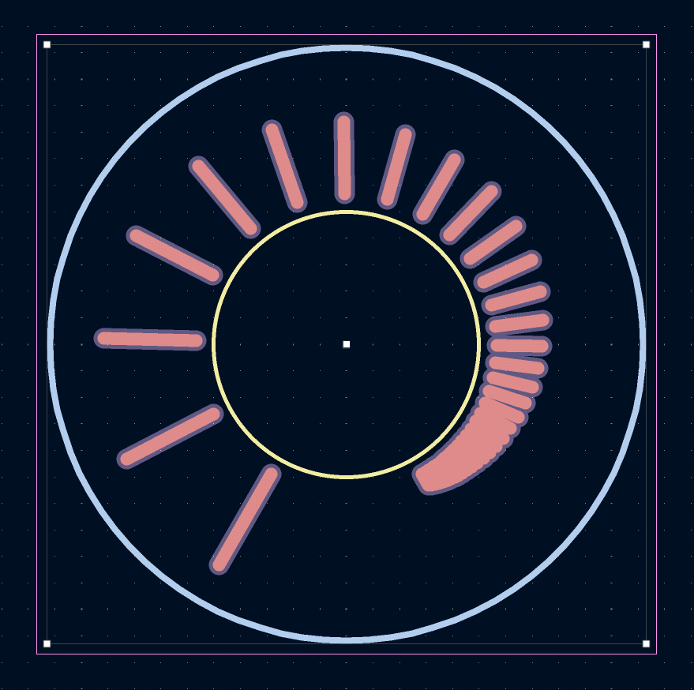

# radial-pattern
Radial pattern generator plugin for KiCad 10

## Usage

* Select a shape, e.g. a hole for a potentiometer

* Click on plugin icon 

* Set parameters and generate pattern

## Example



## Installation

* Clone repo to 

```
~/.local/share/kicad/10.0/plugins/
```

* Restart KiCad

* Icon for plugin should appear in pcbnew

## Issues

* Groupping does not remain after deselecting generated objects
    - Workaround: after plugin finishes, Right Click --> Groupping --> Group Items
